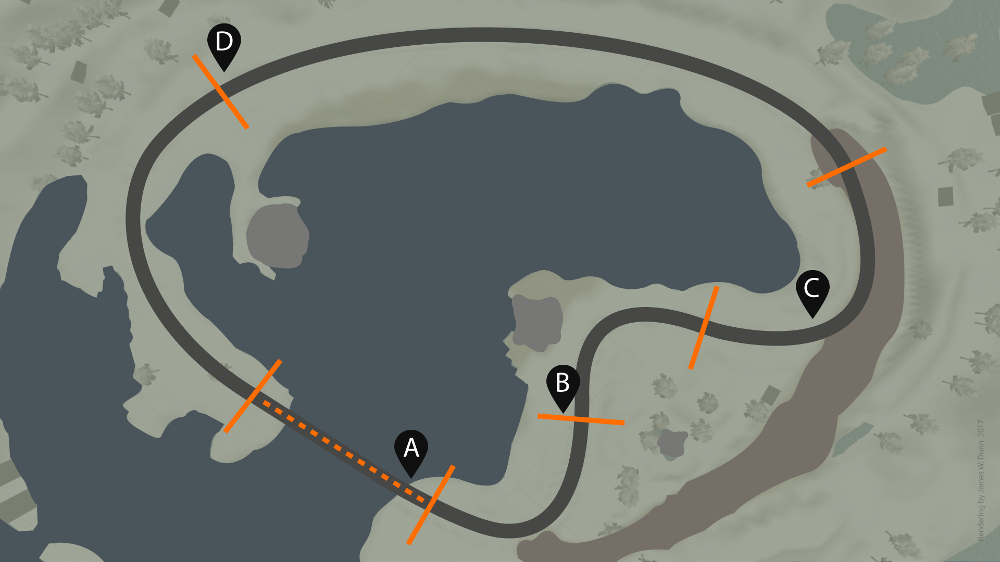

# CarND-Controls-PID
Self-Driving Car Engineer Nanodegree Program

---

## Overview
The included source implements a PID controller to steer a simulated vehicle around a virtual race track. Please fasten your seat belts.



### PID Components

The <b>proportional</b> term creates a value in correspondence to the current error value. This steers the vehicle towards the "ground truth" center line of the road, however if this is the sole component of the calculation it can overshoot and lead to oscillation.

The <b>integral</b> term creates a value in correspondence to past cummulative error. This can alleviate accumulated offsets, but large values can accelerate the movement of the process towards setpoint.

The <b>derivative</b> term predicts a future error value in correspondence to the current rate of change. This term dampens the approach to the setpoint or center line.

Each term is weighted by a gain constant and then summed.

### Tuning the hyperparameters

The over-arching goal is to safely navigate the track without crossing a yellow line on the first lap. Secondary goal is to minimize lap time. The biggest challenge is that there is no map or sensor to predict the future (other than the camera data which is not used).

Manual adjustments were made to the weights through trial, error, and logic. Speed and momentum of the simulated vehicle proved challenging. See: https://robotics.stackexchange.com/questions/167/what-are-good-strategies-for-tuning-pid-loops

Through experimentation and experience with racing on real race tracks, it became clear that a gear model might help to separate the modes of acceleration and cornering. I created five virtual "gears" based on the speed reported by the simulator. First gear is the initial state and basically launches the car without regard for steering.

Above 18 mph, second gear takes over. Above 25 is third. Above 30 is fourth. Above 40 is fifth. Each gear provides enough throttle to reach the next gear. Each higher gear has a narrower limit on steering angles. And each higher gear relaxes the constaint on the cross-track error (CTE) which will cause braking, but each applies progressively stronger braking. If the abs(CTE) is greater than 3.8, then "vehicle off track" is assumed and the simulator is reset. If the vehicle goes out of bounds, the weights must be adjusted manually.

A simulator steering bias was measured and corrected to balance the left and right steering limits.

With this controller model in place, the vehicle safely negotiates the corners at 18-25mph and, after the first lap, runs up to fifth gear on the big curve reaching speeds over 76 mph (in the "Fastest" graphics quality mode with "Windowed" 1280x960 resolution) at the point marked "D" on the map.

Lap time is about 1 minute 40 seconds. The model builds speed when there are few obstacles such as curves or non-smooth ground truth, and applies brakes when significant cross-track error exists.

The model was tested in a variety of simulator resolution and render modes, and also for long periods of time to determine if an off-track fault might be encountered. Final PID coefficients: Kp=1.0, Ki=0.0, and Kd=32.0 in first and second gear, and Kd=64.0 in fourth and fifth gear.

[](https://vimeo.com/219612239)

### Further research
1. The ground truth measures contain anomalies (notably the far end of the bridge [the point marked "A" on the map], the joints of the curves [point "B"], and the zig-zags in final sharp left [point "C"]). 2. Additional time can be spent on tuning gear transitions. 3. A script-controlled operational framework would facilitate automated testing across the matrix of screen resolutions and graphics qualities.

## Dependencies

* cmake >= 3.5
 * All OSes: [click here for installation instructions](https://cmake.org/install/)
* make >= 4.1
  * Linux: make is installed by default on most Linux distros
  * Mac: [install Xcode command line tools to get make](https://developer.apple.com/xcode/features/)
  * Windows: [Click here for installation instructions](http://gnuwin32.sourceforge.net/packages/make.htm)
* gcc/g++ >= 5.4
  * Linux: gcc / g++ is installed by default on most Linux distros
  * Mac: same deal as make - [install Xcode command line tools]((https://developer.apple.com/xcode/features/)
  * Windows: recommend using [MinGW](http://www.mingw.org/)
* [uWebSockets](https://github.com/uWebSockets/uWebSockets)
  * Run either `./install-mac.sh` or `./install-ubuntu.sh`.
  * If you install from source, checkout to commit `e94b6e1`, i.e.
    ```
    git clone https://github.com/uWebSockets/uWebSockets 
    cd uWebSockets
    git checkout e94b6e1
    ```
    Some function signatures have changed in v0.14.x. See [this PR](https://github.com/udacity/CarND-MPC-Project/pull/3) for more details.
* Simulator. You can download these from the [project intro page](https://github.com/udacity/self-driving-car-sim/releases) in the classroom.

## Basic Build Instructions

1. Clone this repo.
2. Make a build directory: `mkdir build && cd build`
3. Compile: `cmake .. && make`
4. Run it: `./pid`. 
